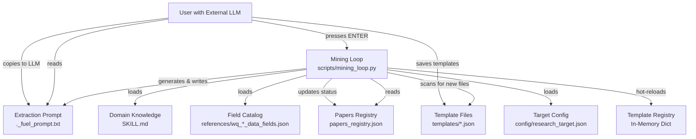

# Design Document: Manual Depth Pause Feature

## Overview

### Feature Summary

The manual-depth-pause feature implements a human-in-the-loop workflow for extracting alpha templates from research papers during the depth phase of the alpha mining system. This feature enables users to leverage external LLMs (ChatGPT, Claude, Gemini, or local models) without requiring API keys, providing full transparency and control over the template extraction process.

### Problem Statement

The current `--depth-backend manual` mode is non-functional—it reads paper content but immediately marks papers as "extraction_failed" without generating extraction prompts, pausing for user input, or providing any mechanism for users to contribute templates. This results in papers being burned without extracting any value.

### Solution Approach

The solution implements a complete pause-resume workflow that:
1. Generates comprehensive LLM-ready extraction prompts containing paper content, domain knowledge, field catalogs, and example templates
2. Saves prompts to a predictable file location for easy access
3. Displays clear step-by-step instructions to guide users through the extraction process
4. Pauses mining loop execution using Python's `input()` function with graceful Ctrl+C handling
5. Detects newly created template files after user resume
6. Hot-reloads the template registry to make new templates immediately available
7. Tracks extraction status with new paper statuses: `pending_extraction` and `extraction_skipped`

### Key Benefits

- **No API Keys Required**: Users can use any LLM interface without needing paid API access
- **Full Transparency**: Complete prompt is visible in a text file, allowing users to review and understand what's being asked
- **Quality Control**: Manual review ensures high-quality templates that align with domain knowledge
- **Flexibility**: Works with ChatGPT, Claude, Gemini, or any local LLM
- **Incremental Progress**: One paper at a time, with ability to skip and retry later
- **Immediate Integration**: New templates are hot-reloaded and used in the next breadth phase

## Architecture

### System Context



### Component Overview

The feature consists of six major components:

1. **Prompt Generation System**: Assembles extraction prompts from multiple sources
2. **File I/O Manager**: Handles reading papers, SKILL content, field catalogs, and writing prompts
3. **Pause/Resume Controller**: Manages user interaction and interrupt handling
4. **Template Detection Engine**: Scans for and validates new template files
5. **Registry Hot-Reload System**: Updates in-memory template registry with new templates
6. **Status Tracking Manager**: Updates papers_registry.json with extraction progress

## Components and Interfaces

### 1. Prompt Generation System

#### Component Responsibilities
- Combine paper content, domain knowledge, field catalog, and example templates into a single LLM-ready prompt
- Format content for optimal LLM comprehension
- Handle content truncation when limits are exceeded
- Include explicit instructions for template extraction

#### Key Functions

##### `generate_extraction_prompt(src_id: str, paper_content: str, field_catalog: list, skill_content: str) -> str`

**Purpose**: Generates a comprehensive extraction prompt for external LLM processing.

**Parameters**:
- `src_id`: Source paper ID (e.g., "src_001")
- `paper_content`: First ~10,000 characters of paper text
- `field_catalog`: List of available data fields from references
- `skill_content`: Domain knowledge content from SKILL.md

**Returns**: Formatted multi-section prompt string ready for LLM

**Algorithm**:
```python
def generate_extraction_prompt(src_id, paper_content, field_catalog, skill_content):
    # 1. Format field catalog summary (max 100 fields, grouped by category)
    field_summary = format_field_catalog_for_prompt(field_catalog, max_fields=100)
    
    # 2. Load 2-3 example templates from templates/ directory
    example_templates = load_example_templates(count=3)
    
    # 3. Load target configuration
    target_config = load_research_target()
    
    # 4. Assemble prompt sections
    prompt_sections = [
        "# Alpha Template Extraction",
        "\nYou are an expert quantitative researcher extracting alpha factors from research papers.\n",
        "## Paper Content\n",
        paper_content,
        "\n## Domain Knowledge\n",
        skill_content,
        "\n## Available Fields\n",
        f"Target: {target_config['region']}/{target_config['universe']}/delay={target_config['delay']}\n",
        field_summary,
        "\n## Example Templates\n",
        json.dumps(example_templates, indent=2, ensure_ascii=False),
        "\n## Task\n",
        "Extract 1-5 alpha templates from this paper...",
        "\n## Output Format\n",
        "Return ONLY valid JSON array (no markdown, no explanations):\n",
        "[{template structure...}]",
        "\n## Important Rules\n",
        "- Use ONLY fields from the Available Fields list\n",
        "- Skeletons must use valid WorldQuant operators\n",
        "- All parameters must have ranges defined\n"
    ]
    
    # 5. Join and validate total length
    prompt = "".join(prompt_sections)
    
    # 6. If prompt exceeds 100,000 chars, reduce field catalog and examples
    if len(prompt) > 100000:
        field_summary = format_field_catalog_for_prompt(field_catalog, max_fields=50)
        example_templates = load_example_templates(count=2)
        # Rebuild prompt with reduced content
    
    return prompt
```

**Error Handling**:
- If SKILL.md is missing, use placeholder text "(SKILL.md not found)"
- If field catalog is missing, use placeholder text "(Field catalog unavailable)"
- If templates directory has < 2 files, return error instead of generating prompt
- If final prompt exceeds 100,000 characters after reduction, log warning but proceed

##### `format_field_catalog_for_prompt(field_catalog: list, max_fields: int = 100) -> str`

**Purpose**: Creates a concise, category-grouped summary of available fields.

**Algorithm**:
```python
def format_field_catalog_for_prompt(field_catalog, max_fields):
    # 1. Group fields by category
    categories = defaultdict(list)
    for field in field_catalog:
        category = field.get("category", "other")
        categories[category].append(field)
    
    # 2. Sort fields within each category by alphaCount (descending)
    for category in categories:
        categories[category].sort(key=lambda f: f.get("alphaCount", 0), reverse=True)
    
    # 3. Select fields to display
    selected_fields = []
    fields_per_category = max_fields // len(categories) if categories else 10
    fields_per_category = max(10, fields_per_category)  # At least 10 per category
    
    for category, fields in sorted(categories.items()):
        # If category has < 10 fields total, include all
        if len(fields) < 10:
            selected_fields.extend(fields)
        else:
            selected_fields.extend(fields[:fields_per_category])
    
    # 4. Format output
    output = [f"Total fields available: {len(field_catalog)}\n\n"]
    output.append("Categories and examples:\n\n")
    
    for category in sorted(categories.keys()):
        fields = categories[category]
        display_count = min(fields_per_category, len(fields))
        output.append(f"**{category.upper()}** ({len(fields)} total):\n")
        
        for field in fields[:display_count]:
            output.append(f"  - {field.get('name', 'unknown')}\n")
        
        if len(fields) > display_count:
            output.append(f"  ... and {len(fields) - display_count} more\n")
        output.append("\n")
    
    return "".join(output)
```

**Behavior**:
- Groups fields by category attribute
- Displays up to 100 total fields across all categories
- Shows up to 10 fields per category as representative examples
- If category has < 10 fields total, includes all fields
- Sorts categories alphabetically
- Adds ellipsis line showing remaining count when truncated

##### `load_example_templates(count: int = 3) -> list`

**Purpose**: Loads example template files to show LLM the expected output format.

**Algorithm**:
```python
def load_example_templates(count):
    templates = []
    template_dir = Path("templates")
    
    if not template_dir.exists():
        logger.warning("Templates directory not found")
        return []
    
    # Get all JSON files
    template_files = sorted(template_dir.glob("*.json"))
    
    # Prioritize templates with highest pass_rate from lessons
    # (requires loading lessons dict if available)
    # Fall back to first N files if lessons not available
    
    for template_file in template_files[:count]:
        try:
            template = json.loads(template_file.read_text(encoding="utf-8"))
            # Include only essential fields for examples
            example = {
                "template_id": template.get("template_id"),
                "description": template.get("description"),
                "skeleton": template.get("skeleton"),
                "field_pairs": template.get("field_pairs", [])[:2],  # Limit to 2 examples
                "param_ranges": template.get("param_ranges"),
                "default_settings": template.get("default_settings"),
                "hypothesis": template.get("hypothesis")
            }
            templates.append(example)
        except Exception as e:
            logger.warning("Failed to load template example file=%s error=%s", template_file.name, e)
            continue
    
    return templates
```

**Selection Strategy**:
- Prioritize templates with highest `pass_rate` from lessons data when available
- Fall back to alphabetical selection if lessons unavailable
- Load only essential fields to reduce prompt size
- Limit field_pairs to 2 examples per template
- Skip invalid JSON files with warning

### 2. File I/O Manager

#### Component Responsibilities
- Read paper content from various source types (PDF, markdown, text)
- Load SKILL.md domain knowledge content
- Load field catalog from references directory
- Load research target configuration
- Write extraction prompt to ._fuel_prompt.txt
- Handle file encoding issues gracefully

#### Key Functions

##### `load_skill_content() -> str`

**Purpose**: Loads domain knowledge from SKILL.md file.

**Algorithm**:
```python
def load_skill_content():
    skill_path = Path("SKILL.md")
    
    if not skill_path.exists():
        logger.warning("SKILL.md not found, using placeholder")
        return "(SKILL.md not found)"
    
    try:
        content = skill_path.read_text(encoding="utf-8")
        logger.info("Loaded SKILL content length=%s", len(content))
        return content
    except Exception as e:
        logger.warning("Failed to read SKILL.md error=%s", e)
        return "(SKILL.md read error)"
```

##### `load_field_catalog() -> list`

**Purpose**: Loads field catalog for the current research target.

**Algorithm**:
```python
def load_field_catalog():
    # 1. Load research target configuration
    target_config = load_research_target()
    
    # 2. Get field catalog path from config
    field_file = target_config.get("fields_reference")
    
    if not field_file:
        logger.warning("No fields_reference in research_target.json")
        return []
    
    # 3. Load catalog
    field_path = Path(field_file)
    if not field_path.exists():
        logger.warning("Field catalog not found path=%s", field_path)
        return []
    
    try:
        catalog = json.loads(field_path.read_text(encoding="utf-8"))
        logger.info("Loaded field catalog count=%s", len(catalog))
        return catalog
    except Exception as e:
        logger.error("Failed to load field catalog path=%s error=%s", field_path, e)
        return []
```

##### `load_research_target() -> dict`

**Purpose**: Loads research target configuration.

**Algorithm**:
```python
def load_research_target():
    target_path = Path("config/research_target.json")
    
    if not target_path.exists():
        logger.error("Research target config not found")
        raise FileNotFoundError("config/research_target.json not found")
    
    try:
        config = json.loads(target_path.read_text(encoding="utf-8"))
        return config
    except Exception as e:
        logger.error("Failed to parse research_target.json error=%s", e)
        raise
```

##### `save_extraction_prompt(prompt: str, file_path: str = "._fuel_prompt.txt") -> bool`

**Purpose**: Writes extraction prompt to file.

**Algorithm**:
```python
def save_extraction_prompt(prompt, file_path):
    try:
        prompt_path = Path(file_path)
        prompt_path.write_text(prompt, encoding="utf-8")
        logger.info("Extraction prompt saved file=%s prompt_len=%s", file_path, len(prompt))
        return True
    except Exception as e:
        logger.error("Failed to save extraction prompt file=%s error=%s", file_path, e)
        return False
```

### 3. Pause/Resume Controller

#### Component Responsibilities
- Display user-friendly instructions for manual extraction workflow
- Pause mining loop execution and wait for user input
- Handle Ctrl+C interrupts gracefully
- Resume mining loop after user completes extraction
- Provide visual separators and formatting for terminal readability

#### Key Functions

##### `display_extraction_instructions(src_id: str, title: str, prompt_file: str) -> None`

**Purpose**: Displays comprehensive instructions for manual extraction workflow.

**Algorithm**:
```python
def display_extraction_instructions(src_id, title, prompt_file):
    separator = "=" * 70
    
    print(f"\n{separator}")
    print("  ⚠️  MANUAL EXTRACTION REQUIRED")
    print(f"{separator}\n")
    
    print(f"Paper: {title}")
    print(f"Source ID: {src_id}")
    print(f"Prompt saved to: {prompt_file}\n")
    
    print("TO EXTRACT TEMPLATES:")
    print("  1. Open the prompt file:")
    print(f"     cat {prompt_file}")
    print("  2. Copy the entire prompt")
    print("  3. Paste into your preferred LLM:")
    print("     • ChatGPT: https://chat.openai.com")
    print("     • Claude: https://claude.ai")
    print("     • Gemini: https://gemini.google.com")
    print("  4. LLM will generate 1-5 template JSON files")
    print("  5. Save each template as:")
    print("     templates/<template_id>.json")
    print("     Example: templates/momentum_reversal_hybrid.json")
    print("  6. Return here and press ENTER to continue\n")
    
    print("The mining loop will resume and use new templates in breadth phase.")
    print("Press Ctrl+C at any time to skip this paper.\n")
    print(f"{separator}\n")
```

**Design Considerations**:
- 70-character line width for standard terminal readability
- Visual separators to draw attention
- Concrete examples (cat command, example filename)
- Three popular LLM options with URLs
- Clear step-by-step numbered instructions
- Reminder about Ctrl+C option

##### `pause_for_user_input() -> bool`

**Purpose**: Pauses execution and waits for user to press ENTER or Ctrl+C.

**Algorithm**:
```python
def pause_for_user_input():
    """
    Pause execution and wait for user input.
    
    Returns:
        True if user pressed ENTER (continue)
        False if user pressed Ctrl+C (skip)
    """
    try:
        input("Press ENTER when templates are saved (or Ctrl+C to skip)... ")
        print("\n[manual] Resuming, scanning for new templates...")
        return True
    except KeyboardInterrupt:
        print("\n\n[manual] Skipped by user (Ctrl+C)")
        return False
```

**Behavior**:
- Blocks until user presses ENTER
- Returns True on normal ENTER press
- Catches KeyboardInterrupt exception on Ctrl+C
- Returns False to indicate skip
- Process remains responsive to signals (not in uninterruptible wait)

### 4. Template Detection Engine

#### Component Responsibilities
- Scan templates directory for JSON files
- Compare pre-pause and post-pause template lists to identify new files
- Validate template file structure and required fields
- Handle template ID collisions
- Report validation errors without crashing

#### Key Functions

##### `detect_new_templates(templates_before: set[Path]) -> list[Path]`

**Purpose**: Identifies template files created during pause.

**Algorithm**:
```python
def detect_new_templates(templates_before):
    template_dir = Path("templates")
    
    if not template_dir.exists():
        logger.info("Templates directory not found")
        return []
    
    # Get current template files
    templates_after = set(template_dir.glob("*.json"))
    
    # Find new files
    new_files = templates_after - templates_before
    
    if new_files:
        logger.info("Detected new templates count=%s", len(new_files))
        for tf in sorted(new_files):
            logger.info("New template file detected file=%s", tf.name)
    
    return list(sorted(new_files))
```

**Edge Cases**:
- If templates directory doesn't exist before pause, treat all files as new
- If templates directory is created during pause, detect all files as new
- Ignore files in subdirectories (only top-level *.json)
- Follow symbolic links and process target files

##### `validate_template_file(file_path: Path, existing_ids: set[str]) -> tuple[bool, Optional[dict], Optional[str]]`

**Purpose**: Validates template file structure and checks for ID collisions.

**Returns**: (is_valid, template_dict, error_message)

**Algorithm**:
```python
def validate_template_file(file_path, existing_ids):
    """
    Validate template file structure.
    
    Returns:
        (is_valid, template_dict, error_message)
    """
    # 1. Check file size
    if file_path.stat().st_size == 0:
        return (False, None, "Empty file (0 bytes)")
    
    # 2. Parse JSON
    try:
        content = file_path.read_text(encoding="utf-8")
        template = json.loads(content)
    except json.JSONDecodeError as e:
        return (False, None, f"Invalid JSON: {e}")
    except Exception as e:
        return (False, None, f"Read error: {e}")
    
    # 3. Validate required fields
    required_fields = ["template_id", "skeleton", "field_pairs", "param_ranges"]
    missing = [f for f in required_fields if f not in template]
    
    if missing:
        return (False, None, f"Missing required fields: {', '.join(missing)}")
    
    # 4. Check template_id collision
    template_id = template.get("template_id")
    if template_id in existing_ids:
        return (False, None, f"Template ID collision: '{template_id}' already exists")
    
    # 5. Basic type validation
    if not isinstance(template["skeleton"], str):
        return (False, None, "skeleton must be a string")
    
    if not isinstance(template["field_pairs"], list):
        return (False, None, "field_pairs must be a list")
    
    if not isinstance(template["param_ranges"], dict):
        return (False, None, "param_ranges must be a dict")
    
    return (True, template, None)
```

**Validation Rules**:
- File must not be empty (> 0 bytes)
- Content must be valid JSON
- Must contain required fields: template_id, skeleton, field_pairs, param_ranges
- template_id must not collide with existing templates
- Basic type checks for required fields

### 5. Registry Hot-Reload System

#### Component Responsibilities
- Reload template registry from templates directory
- Update in-memory template dictionary with new templates
- Log reload statistics
- Preserve existing valid templates
- Trigger breadth phase reset to use new templates

#### Key Functions

##### `reload_template_registry() -> dict`

**Purpose**: Reloads all templates from templates directory into memory.

**Algorithm**:
```python
def reload_template_registry():
    """
    Reload template registry from templates/ directory.
    
    Returns:
        Updated template registry dict {template_id: template_dict}
    """
    templates = {}
    template_dir = Path("templates")
    
    if not template_dir.exists():
        logger.warning("Templates directory not found")
        return templates
    
    # Scan all JSON files
    for template_file in template_dir.glob("*.json"):
        try:
            template = json.loads(template_file.read_text(encoding="utf-8"))
            template_id = template.get("template_id")
            
            if not template_id:
                logger.warning("Template missing template_id file=%s", template_file.name)
                continue
            
            templates[template_id] = template
            logger.debug("Loaded template template_id=%s file=%s", template_id, template_file.name)
            
        except Exception as e:
            logger.warning("Failed to load template file=%s error=%s", template_file.name, str(e))
            continue
    
    logger.info("Template registry reloaded total=%s", len(templates))
    return templates
```

**Behavior**:
- Scans entire templates directory on each reload
- Overwrites existing entries with same template_id
- Preserves templates not found in directory
- Logs warnings for invalid files but continues
- Returns complete updated registry

##### `trigger_breadth_reset(state: dict) -> None`

**Purpose**: Resets consecutive_no_active counter to force breadth phase execution.

**Algorithm**:
```python
def trigger_breadth_reset(state):
    """
    Reset consecutive_no_active counter to ensure breadth phase runs.
    
    When new templates are loaded, we want to immediately use them
    in the next breadth phase, even if it would otherwise be skipped.
    """
    state["consecutive_no_active"] = 0
    logger.info("Reset consecutive_no_active to force breadth phase with new templates")
```

**Rationale**:
- Mining loop skips breadth phase after 2+ consecutive rounds with no ACTIVE alphas
- New templates should immediately be tested in breadth phase
- Resetting counter ensures breadth runs in next round
- Prevents new templates from sitting unused

### 6. Status Tracking Manager

#### Component Responsibilities
- Update paper status in papers_registry.json
- Record timestamps for status transitions
- Track prompt file paths and generated template IDs
- Recompute registry statistics after updates
- Maintain backwards compatibility with existing status values

#### Key Functions

##### `update_paper_status(reg: dict, src_id: str, status: str, metadata: dict = None) -> None`

**Purpose**: Updates paper status and associated metadata.

**Algorithm**:
```python
def update_paper_status(reg, src_id, status, metadata=None):
    """
    Update paper status and metadata.
    
    Args:
        reg: Papers registry dict
        src_id: Source paper ID
        status: New status value
        metadata: Optional metadata dict to merge
    """
    src = reg["sources"][src_id]
    src["status"] = status
    
    # Add timestamp for status transition
    timestamp = datetime.now(timezone.utc).isoformat()
    
    if status == "pending_extraction":
        src["prompt_generated_date"] = timestamp
        if metadata and "prompt_file" in metadata:
            src["prompt_file"] = metadata["prompt_file"]
    
    elif status == "extraction_skipped":
        src["skipped_date"] = timestamp
    
    elif status == "consumed":
        src["consumed_date"] = timestamp
        if metadata and "templates_created" in metadata:
            src["templates_created"] = metadata["templates_created"]
    
    elif status == "extraction_failed":
        src["read_date"] = timestamp
        src["extraction_attempts"] = src.get("extraction_attempts", 0) + 1
    
    # Recompute statistics
    _refresh_registry_stats(reg)
    
    # Save immediately
    save_papers_registry(reg)
    
    logger.info("Updated paper status source_id=%s status=%s", src_id, status)
```

**Status Transitions**:
- `unread` → `pending_extraction`: Prompt generated, waiting for user
- `pending_extraction` → `consumed`: User provided valid templates
- `pending_extraction` → `extraction_skipped`: User pressed Ctrl+C
- `pending_extraction` → `extraction_failed`: Validation or file errors
- Any status → `pending_extraction`: Retry extraction

##### `_refresh_registry_stats(reg: dict) -> None`

**Purpose**: Recomputes papers_registry statistics from source statuses.

**Algorithm**:
```python
def _refresh_registry_stats(reg):
    """
    Recompute statistics from source statuses.
    
    Stats:
        consumed: Count of papers with status="consumed"
        remaining: total - consumed
    """
    sources = reg.get("sources", {})
    total = len(sources)
    consumed = sum(1 for s in sources.values() if s.get("status") == "consumed")
    remaining = max(0, total - consumed)
    
    reg["stats"]["total"] = total
    reg["stats"]["consumed"] = consumed
    reg["stats"]["remaining"] = remaining
    
    logger.debug("Registry stats total=%s consumed=%s remaining=%s", total, consumed, remaining)
```

**Statistics Semantics**:
- `consumed`: Papers with status exactly "consumed"
- `remaining`: All papers NOT consumed (includes pending_extraction, extraction_skipped, extraction_failed, unread)
- `total`: Total number of papers in registry
- Statistics recomputed from source after every status update

## Data Models

### Papers Registry Structure

```json
{
  "sources": {
    "src_001": {
      "source_id": "src_001",
      "title": "Paper Title",
      "type": "pdf",
      "locator": "papers/paper1.pdf",
      "status": "pending_extraction",
      "prompt_generated_date": "2024-08-12T10:30:00Z",
      "prompt_file": "._fuel_prompt.txt",
      "extraction_attempts": 0
    },
    "src_002": {
      "source_id": "src_002",
      "title": "Another Paper",
      "type": "markdown",
      "locator": "papers/paper2.md",
      "status": "extraction_skipped",
      "skipped_date": "2024-08-12T10:35:00Z"
    },
    "src_003": {
      "source_id": "src_003",
      "title": "Consumed Paper",
      "type": "pdf",
      "locator": "papers/paper3.pdf",
      "status": "consumed",
      "consumed_date": "2024-08-12T10:40:00Z",
      "templates_created": ["momentum_reversal_hybrid", "volume_price_divergence"]
    }
  },
  "stats": {
    "total": 50,
    "consumed": 15,
    "remaining": 35
  }
}
```

### Paper Status Values

| Status | Meaning | Timestamp Field | Retryable |
|--------|---------|-----------------|-----------|
| `unread` | Not yet processed | - | Yes |
| `pending_extraction` | Prompt generated, waiting for templates | `prompt_generated_date` | Yes |
| `extraction_skipped` | User pressed Ctrl+C to skip | `skipped_date` | Yes |
| `consumed` | Successfully extracted templates | `consumed_date` | No |
| `extraction_failed` | Error during extraction process | `read_date` | Yes |

### Template File Structure

```json
{
  "template_id": "momentum_reversal_hybrid",
  "description": "Brief description from paper",
  "skeleton": "group_rank(ts_rank({signal}, {window}), {group})",
  "field_pairs": [
    {
      "name": "signal",
      "numerator": "close / open - 1",
      "denominator": "1"
    }
  ],
  "param_ranges": {
    "window": [10, 21, 63],
    "group": ["subindustry", "industry"]
  },
  "default_settings": {
    "decay": [0, 4],
    "neutralization": "SUBINDUSTRY"
  },
  "hypothesis": "Why this factor predicts returns",
  "source": "Paper title or reference"
}
```

### Extraction Prompt Structure

```
# Alpha Template Extraction

You are an expert quantitative researcher extracting alpha factors from research papers.

## Paper Content

[First 10,000 characters of paper text]

## Domain Knowledge

[Content from SKILL.md sections 4, 6, 10]

## Available Fields

Target: GLB/TOPDIV3000/delay=1

Total fields available: 10,247

Categories and examples:

**FUNDAMENTAL** (1652 total):
  - operating_income
  - equity
  - free_cash_flow_reported_value
  ... and 1642 more

**ANALYST** (1324 total):
  - est_eps
  - est_revenue
  ... and 1314 more

[... more categories ...]

## Example Templates

[2-3 complete template JSON examples]

## Task

Extract 1-5 alpha templates from this paper.

For each alpha:
1. Identify the core mathematical formula
2. Map paper variables to WorldQuant fields
3. Create parameterized template skeleton
4. Specify param_ranges for exploration
5. Add hypothesis explaining the signal

## Output Format

Return ONLY valid JSON array (no markdown, no explanations):

[
  {
    "template_id": "descriptive_name",
    "description": "...",
    "skeleton": "...",
    "field_pairs": [...],
    "param_ranges": {...},
    "default_settings": {...},
    "hypothesis": "..."
  }
]

## Important Rules

- Use ONLY fields from the Available Fields list
- Skeletons must use valid WorldQuant operators (rank, group_rank, ts_rank, etc.)
- All parameters in skeleton must have ranges defined in param_ranges
- Test mentally that field combinations make sense (e.g., don't divide volume by sentiment)
- Output ONLY JSON array, no markdown code fences or explanatory text
```

## Error Handling

### Error Categories and Responses

#### 1. Missing Dependencies

**Errors**:
- SKILL.md not found
- config/research_target.json not found
- Field catalog file not found
- Templates directory has < 2 files

**Response**:
```python
if not skill_path.exists():
    logger.error("Missing dependency file=SKILL.md")
    print("[manual] ERROR: SKILL.md not found. Cannot generate extraction prompt.")
    src["status"] = "extraction_failed"
    return False

if len(template_files) < 2:
    logger.error("Insufficient template examples count=%s", len(template_files))
    print(f"[manual] ERROR: Need at least 2 template examples, found {len(template_files)}")
    src["status"] = "extraction_failed"
    return False
```

**User Action**: Fix missing files and retry

#### 2. Paper Content Issues

**Errors**:
- Paper file not found
- Paper file unreadable (encoding errors)
- Paper content < 100 characters

**Response**:
```python
if not paper_path.exists():
    logger.error("Paper file not found source_id=%s path=%s", src_id, paper_path)
    print(f"[manual] ERROR: Paper file not found: {paper_path}")
    src["status"] = "extraction_failed"
    return False

if len(text) < 100:
    logger.warning("Paper content too short source_id=%s chars=%s", src_id, len(text))
    print(f"[manual] WARNING: Paper content too short ({len(text)} chars), skipping.")
    src["status"] = "extraction_failed"
    return False
```

**User Action**: Check paper file path and content

#### 3. Prompt Size Overflow

**Error**: Assembled prompt exceeds 100,000 characters

**Response**:
```python
if len(prompt) > 100000:
    logger.warning("Prompt exceeds size limit, reducing content prompt_len=%s", len(prompt))
    
    # Reduce field catalog to 50 fields minimum
    field_summary = format_field_catalog_for_prompt(field_catalog, max_fields=50)
    
    # Reduce examples to 2 minimum
    example_templates = load_example_templates(count=2)
    
    # Rebuild prompt
    prompt = generate_extraction_prompt(...)
    
    if len(prompt) > 100000:
        logger.error("Prompt still exceeds limit after reduction prompt_len=%s", len(prompt))
        print("[manual] WARNING: Prompt is very large, some content may be truncated by LLM")
        # Proceed anyway - user can manually edit prompt file if needed
```

**User Action**: None - system handles automatically

#### 4. Template Validation Failures

**Errors**:
- Empty template file (0 bytes)
- Invalid JSON syntax
- Missing required fields
- Template ID collision

**Response**:
```python
is_valid, template, error = validate_template_file(file_path, existing_ids)

if not is_valid:
    logger.warning("Template validation failed file=%s error=%s", file_path.name, error)
    print(f"  [manual] WARNING: {file_path.name} - {error}")
    # Skip this file but continue with others
    continue
```

**User Action**: Fix template file and save again, press ENTER to retry

#### 5. File I/O Failures

**Errors**:
- Cannot write ._fuel_prompt.txt (permissions)
- Cannot read template file (encoding)
- Cannot update papers_registry.json

**Response**:
```python
try:
    prompt_path.write_text(prompt, encoding="utf-8")
except Exception as e:
    logger.error("Failed to save extraction prompt file=%s error=%s", prompt_path, e)
    print(f"[manual] ERROR: Cannot save prompt file: {e}")
    src["status"] = "extraction_failed"
    save_papers_registry(reg)
    return False
```

**User Action**: Check file permissions and disk space

### Error Recovery Strategies

#### Graceful Degradation
- Missing SKILL.md: Use placeholder text, continue
- Missing field catalog: Use placeholder text, warn user
- Template validation failures: Skip invalid files, load valid ones

#### Retry Support
- Papers with `extraction_failed` status can be retried in future runs
- Papers with `extraction_skipped` status can be retried in future runs
- Papers with `pending_extraction` status can be retried (generates new prompt)

#### Logging Strategy
- ERROR level: Fatal errors that prevent extraction (missing dependencies)
- WARNING level: Non-fatal issues (validation failures, size issues)
- INFO level: Normal operations (status updates, file saves)
- DEBUG level: Detailed diagnostics (template loads, field counts)

## Testing Strategy

### Testing Approach

This feature is **not suitable for property-based testing** because it involves:
- Infrastructure and file I/O operations
- External service integration (user + LLM workflow)
- Deterministic workflow with side effects
- One-shot operations (prompts, pauses, user input)

Testing will focus on:
1. **Unit Tests**: Specific examples and edge cases for pure functions
2. **Integration Tests**: End-to-end workflow with real files (1-2 examples per scenario)
3. **Smoke Tests**: Configuration checks and file availability

### Unit Tests

#### Prompt Generation Tests
```python
def test_format_field_catalog_basic():
    """Test field catalog formatting with normal input"""
    catalog = [
        {"name": "field1", "category": "fundamental", "alphaCount": 100},
        {"name": "field2", "category": "fundamental", "alphaCount": 50},
        {"name": "field3", "category": "pv", "alphaCount": 200},
    ]
    result = format_field_catalog_for_prompt(catalog, max_fields=100)
    assert "FUNDAMENTAL" in result
    assert "PV" in result
    assert "field1" in result

def test_format_field_catalog_small_category():
    """Test that categories with < 10 fields show all fields"""
    catalog = [
        {"name": f"field{i}", "category": "small", "alphaCount": i} 
        for i in range(5)
    ]
    result = format_field_catalog_for_prompt(catalog, max_fields=100)
    assert "... and" not in result  # No truncation
    assert all(f"field{i}" in result for i in range(5))

def test_load_example_templates_priority():
    """Test that templates are prioritized by pass_rate when available"""
    # Create test templates with known pass rates
    # Verify highest pass_rate templates are selected first

def test_generate_prompt_size_limit():
    """Test that prompt is reduced when exceeding 100k chars"""
    # Generate very large field catalog and paper content
    # Verify prompt is reduced to fit within limit
```

#### Validation Tests
```python
def test_validate_template_valid():
    """Test validation passes for valid template"""
    template = {
        "template_id": "test",
        "skeleton": "rank(close)",
        "field_pairs": [],
        "param_ranges": {}
    }
    is_valid, _, error = validate_template_file(template_path, set())
    assert is_valid
    assert error is None

def test_validate_template_missing_fields():
    """Test validation fails when required fields missing"""
    template = {"template_id": "test"}  # Missing skeleton, field_pairs, param_ranges
    is_valid, _, error = validate_template_file(template_path, set())
    assert not is_valid
    assert "Missing required fields" in error

def test_validate_template_collision():
    """Test validation fails for duplicate template_id"""
    existing_ids = {"test"}
    template = {
        "template_id": "test",
        "skeleton": "rank(close)",
        "field_pairs": [],
        "param_ranges": {}
    }
    is_valid, _, error = validate_template_file(template_path, existing_ids)
    assert not is_valid
    assert "collision" in error.lower()

def test_validate_template_empty_file():
    """Test validation fails for empty file"""
    # Create 0-byte file
    is_valid, _, error = validate_template_file(empty_file_path, set())
    assert not is_valid
    assert "Empty file" in error
```

#### Status Tracking Tests
```python
def test_update_paper_status_pending():
    """Test status update to pending_extraction"""
    reg = {"sources": {"src_001": {}}, "stats": {}}
    update_paper_status(reg, "src_001", "pending_extraction", 
                       {"prompt_file": "._fuel_prompt.txt"})
    assert reg["sources"]["src_001"]["status"] == "pending_extraction"
    assert "prompt_generated_date" in reg["sources"]["src_001"]
    assert reg["sources"]["src_001"]["prompt_file"] == "._fuel_prompt.txt"

def test_update_paper_status_consumed():
    """Test status update to consumed with templates"""
    reg = {"sources": {"src_001": {}}, "stats": {"total": 1, "consumed": 0}}
    update_paper_status(reg, "src_001", "consumed",
                       {"templates_created": ["template1", "template2"]})
    assert reg["sources"]["src_001"]["status"] == "consumed"
    assert len(reg["sources"]["src_001"]["templates_created"]) == 2
    assert reg["stats"]["consumed"] == 1

def test_refresh_registry_stats():
    """Test statistics recomputation"""
    reg = {
        "sources": {
            "src_001": {"status": "consumed"},
            "src_002": {"status": "pending_extraction"},
            "src_003": {"status": "consumed"},
            "src_004": {"status": "unread"}
        },
        "stats": {}
    }
    _refresh_registry_stats(reg)
    assert reg["stats"]["total"] == 4
    assert reg["stats"]["consumed"] == 2
    assert reg["stats"]["remaining"] == 2
```

### Integration Tests

#### Happy Path Test
```python
def test_manual_extraction_happy_path(tmp_path, monkeypatch):
    """
    Test complete manual extraction workflow:
    1. Generate prompt
    2. Save to file
    3. Simulate user creating templates
    4. Detect new templates
    5. Reload registry
    """
    # Setup test environment
    setup_test_papers_registry(tmp_path)
    setup_test_templates_dir(tmp_path)
    setup_test_skill_md(tmp_path)
    setup_test_field_catalog(tmp_path)
    
    # Mock input() to return immediately
    monkeypatch.setattr('builtins.input', lambda _: None)
    
    # Run manual extraction
    result = fuel_one_paper_manual("src_001", registry, lessons)
    
    # Verify prompt was generated and saved
    assert Path("._fuel_prompt.txt").exists()
    prompt = Path("._fuel_prompt.txt").read_text()
    assert "Alpha Template Extraction" in prompt
    assert "Paper Content" in prompt
    
    # Simulate user creating template
    new_template = {
        "template_id": "test_template",
        "skeleton": "rank(close)",
        "field_pairs": [],
        "param_ranges": {}
    }
    (tmp_path / "templates" / "test_template.json").write_text(
        json.dumps(new_template)
    )
    
    # Verify template was detected
    assert result == True
    assert registry["sources"]["src_001"]["status"] == "consumed"
    assert "test_template" in registry["sources"]["src_001"]["templates_created"]
```

#### Skip with Ctrl+C Test
```python
def test_manual_extraction_skip(tmp_path, monkeypatch):
    """
    Test user skipping extraction with Ctrl+C:
    1. Generate prompt
    2. Simulate Ctrl+C
    3. Verify status is extraction_skipped
    """
    setup_test_environment(tmp_path)
    
    # Mock input() to raise KeyboardInterrupt
    monkeypatch.setattr('builtins.input', lambda _: raise_keyboard_interrupt())
    
    result = fuel_one_paper_manual("src_001", registry, lessons)
    
    assert result == False
    assert registry["sources"]["src_001"]["status"] == "extraction_skipped"
    assert "skipped_date" in registry["sources"]["src_001"]
```

#### No Templates Created Test
```python
def test_manual_extraction_no_templates(tmp_path, monkeypatch):
    """
    Test workflow when user presses ENTER but creates no templates:
    1. Generate prompt
    2. User presses ENTER
    3. No new templates detected
    4. Status remains pending_extraction
    """
    setup_test_environment(tmp_path)
    monkeypatch.setattr('builtins.input', lambda _: None)
    
    result = fuel_one_paper_manual("src_001", registry, lessons)
    
    assert result == False
    assert registry["sources"]["src_001"]["status"] == "pending_extraction"
```

#### Template Validation Failure Test
```python
def test_manual_extraction_invalid_template(tmp_path, monkeypatch):
    """
    Test workflow when user creates invalid template:
    1. Generate prompt
    2. User creates template with missing fields
    3. Validation fails, template skipped
    4. No templates loaded, but no crash
    """
    setup_test_environment(tmp_path)
    monkeypatch.setattr('builtins.input', lambda _: None)
    
    # Create invalid template (missing required fields)
    (tmp_path / "templates" / "invalid.json").write_text('{"template_id": "bad"}')
    
    result = fuel_one_paper_manual("src_001", registry, lessons)
    
    # Should continue without crashing
    assert result == False
    # Invalid template not loaded
    template_registry = reload_template_registry()
    assert "bad" not in template_registry
```

### Smoke Tests

```python
def test_skill_md_exists():
    """Verify SKILL.md file exists and is readable"""
    assert Path("SKILL.md").exists()
    content = load_skill_content()
    assert len(content) > 1000

def test_research_target_config_exists():
    """Verify research_target.json exists and has required fields"""
    config = load_research_target()
    assert "region" in config
    assert "universe" in config
    assert "delay" in config
    assert "fields_reference" in config

def test_field_catalog_exists():
    """Verify field catalog file exists and has fields"""
    catalog = load_field_catalog()
    assert len(catalog) > 100
    assert all("name" in f for f in catalog[:10])

def test_templates_directory_has_examples():
    """Verify templates directory has at least 2 example templates"""
    templates = load_example_templates(count=3)
    assert len(templates) >= 2
```

### Edge Case Tests

```python
def test_template_id_collision_handling():
    """Test that duplicate template IDs are detected and skipped"""
    # Create two templates with same ID
    # Verify only first is loaded, second generates warning

def test_templates_directory_created_during_pause():
    """Test detection when templates/ directory created during pause"""
    # Start with no templates directory
    # Simulate creation during pause
    # Verify all files detected as new

def test_symbolic_link_template_files():
    """Test that symbolic links are followed and processed"""
    # Create template file and symbolic link to it
    # Verify both are processed correctly

def test_subdirectory_templates_ignored():
    """Test that templates in subdirectories are ignored"""
    # Create templates/subdir/template.json
    # Verify it's not detected as new template

def test_paper_content_truncation():
    """Test paper content truncation at 10,000 chars"""
    # Create paper with 15,000 characters
    # Verify prompt contains first 8,000 + "[... TRUNCATED ...]" + last 2,000
```

### Test Data Setup

```python
def setup_test_papers_registry(tmp_path):
    """Create test papers_registry.json"""
    reg = {
        "sources": {
            "src_001": {
                "source_id": "src_001",
                "title": "Test Paper",
                "type": "pdf",
                "locator": str(tmp_path / "papers" / "test.pdf"),
                "status": "unread"
            }
        },
        "stats": {"total": 1, "consumed": 0, "remaining": 1}
    }
    return reg

def setup_test_skill_md(tmp_path):
    """Create minimal test SKILL.md"""
    skill_content = """
# WQ Alpha 研究 Skill

## 4. 因子模板库

Test template content...

## 6. 问题诊断与修复

Test diagnostics content...

## 10. 核心经验

Test experience content...
"""
    (tmp_path / "SKILL.md").write_text(skill_content)

def setup_test_field_catalog(tmp_path):
    """Create minimal test field catalog"""
    fields = [
        {"name": f"field{i}", "category": "fundamental", "alphaCount": 100-i}
        for i in range(50)
    ]
    catalog_path = tmp_path / "references" / "test_fields.json"
    catalog_path.parent.mkdir(parents=True, exist_ok=True)
    catalog_path.write_text(json.dumps(fields))
```

### Manual Testing Checklist

Since this feature involves user interaction, manual testing is essential:

- [ ] Generate prompt with real paper content, verify all sections present
- [ ] Copy prompt to ChatGPT, verify it generates valid templates
- [ ] Copy prompt to Claude, verify it generates valid templates
- [ ] Test Ctrl+C during pause, verify graceful skip
- [ ] Test pressing ENTER without creating templates, verify correct status
- [ ] Test creating valid templates, verify detection and reload
- [ ] Test creating invalid templates, verify warnings but no crash
- [ ] Test creating templates with duplicate IDs, verify collision warnings
- [ ] Verify new templates appear in next breadth phase
- [ ] Test with missing SKILL.md, verify placeholder text used
- [ ] Test with missing field catalog, verify placeholder text used
- [ ] Test with < 2 example templates, verify error message
- [ ] Test prompt file can be read with `cat` command
- [ ] Verify terminal instructions fit within 80-character width

### Performance Considerations

- **Prompt Generation**: Should complete in < 1 second for typical papers
- **Template Scanning**: Should complete in < 100ms for directories with < 100 templates
- **Registry Reload**: Should complete in < 500ms for typical template counts
- **No performance testing needed**: This is a user-interactive workflow with human-in-the-loop delays

## Implementation Notes

### Integration Points

#### 1. fuel_one_paper_manual() Function
**Location**: `scripts/mining_loop.py` lines ~1515-1566

**Current Implementation**: Broken - reads paper, marks as extraction_failed, returns False

**Required Changes**: Complete rewrite following design in Pause/Resume Controller section

**Signature**:
```python
def fuel_one_paper_manual(src_id: str, reg: dict, lessons: dict) -> bool:
    """
    Manual extraction workflow with pause and resume.
    
    Returns:
        True if new templates were created and loaded
        False if extraction was skipped or failed
    """
```

#### 2. run_mining_loop() Function
**Location**: `scripts/mining_loop.py` lines ~1615+

**Required Changes**: Add template reload and breadth reset after successful manual extraction

**Modification**:
```python
# After depth phase in run_mining_loop()
if depth_fueled:
    logger.info("Depth phase fueled, reloading template registry")
    print("[depth] New templates detected, reloading registry...")
    
    # Reload templates
    template_registry = reload_template_registry()
    state["template_count"] = len(template_registry)
    
    # Reset counter to force breadth phase
    state["consecutive_no_active"] = 0
    
    logger.info("Template registry updated count=%s", len(template_registry))
    print(f"[depth] Loaded {len(template_registry)} templates (including new ones)\n")
```

### Dependencies

**External Libraries** (already in use):
- `json`: Template and registry parsing
- `pathlib`: File path operations
- `datetime`: Timestamp generation
- `logging`: Diagnostic logging

**No New Dependencies Required**

### Configuration

**No new configuration files required**

Existing configuration files used:
- `config/research_target.json`: Target pool settings
- `papers_registry.json`: Paper tracking (modified with new statuses)
- `SKILL.md`: Domain knowledge (read-only)
- `references/wq_*_data_fields.json`: Field catalogs (read-only)

### Deployment Considerations

**Backwards Compatibility**:
- New status values (`pending_extraction`, `extraction_skipped`) coexist with existing values
- Statistics computation unchanged (only `consumed` status counts as consumed)
- Existing papers with old status values continue to work
- No migration required for existing `papers_registry.json`

**Rollback Safety**:
- If feature needs to be disabled, simply don't use `--depth-backend manual`
- Old status values remain valid
- No data corruption risk

**User Migration**:
- Users need to understand the new workflow (instructions displayed automatically)
- No configuration changes required
- Works immediately after deployment

### Logging Tags

All log messages related to manual extraction include identifiable tags for filtering:

**Console Output Tags**:
- `[depth-manual]`: General manual extraction messages
- `[manual]`: Specific workflow messages

**Logger Tags**:
- `source_id=%s`: Always include source paper ID
- `prompt_len=%s`: Prompt character count
- `new_templates=%s`: Count of new templates detected
- `status=%s`: Paper status after operations

**Log Levels**:
- `ERROR`: Missing dependencies, file I/O failures
- `WARNING`: Validation failures, size issues, empty files
- `INFO`: Status updates, file operations, template counts
- `DEBUG`: Template loads, field counts, detailed diagnostics

### Future Enhancements

**Potential Future Improvements** (out of scope for this feature):

1. **Timeout Support**: Add optional `--manual-timeout` flag to skip papers after N minutes
2. **Batch Mode**: Allow processing multiple papers before pause
3. **Template Preview**: Display generated templates before accepting
4. **LLM Integration**: Direct API integration with ChatGPT/Claude (requires API keys)
5. **Prompt Templates**: Allow customization of extraction prompt format
6. **Field Filtering**: Let users specify which field categories to include in prompt
7. **Auto-Validation**: Test generated templates in simulation before accepting
8. **Progress Dashboard**: Web UI for monitoring extraction progress
9. **Collaborative Mode**: Multiple users can extract from different papers simultaneously

**None of these are required for initial release**

---

## Design Sign-Off

This design document covers all 15 requirements from the requirements specification:

✅ Requirement 1: Generate LLM-Ready Extraction Prompt  
✅ Requirement 2: Save Extraction Prompt to File  
✅ Requirement 3: Update Paper Status Tracking  
✅ Requirement 4: Display User Instructions  
✅ Requirement 5: Implement Pause and Resume Mechanism  
✅ Requirement 6: Detect and Validate New Template Files  
✅ Requirement 7: Hot-Reload Template Registry  
✅ Requirement 8: Handle Template ID Collisions  
✅ Requirement 9: Format Field Catalog for Prompt  
✅ Requirement 10: Load Domain Knowledge Content  
✅ Requirement 11: Validate Paper Content Availability  
✅ Requirement 12: Preserve Parser Round-Trip Property  
✅ Requirement 13: Handle Edge Cases in Template Detection  
✅ Requirement 14: Log Comprehensive Diagnostic Information  
✅ Requirement 15: Maintain Backwards Compatibility with Existing Status Values  

**Ready for implementation.**
