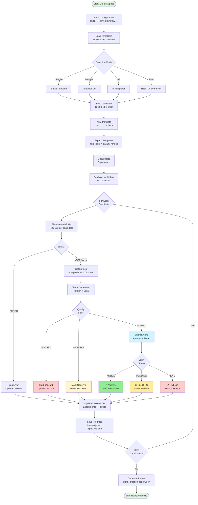
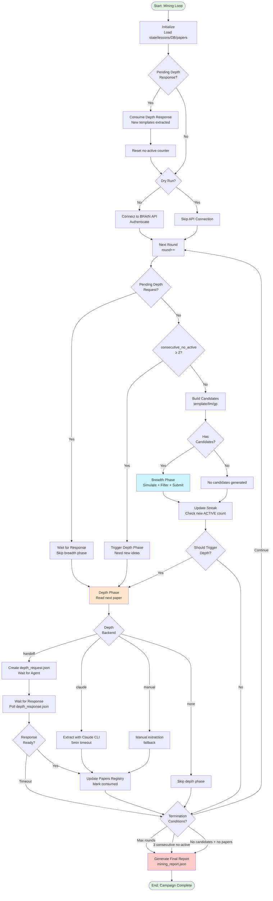
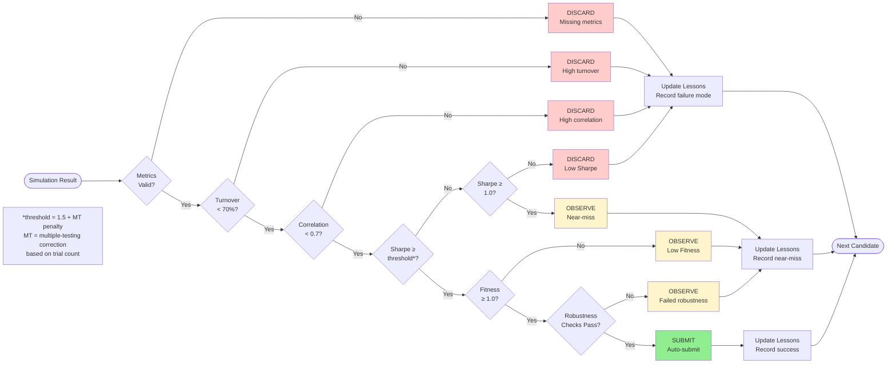
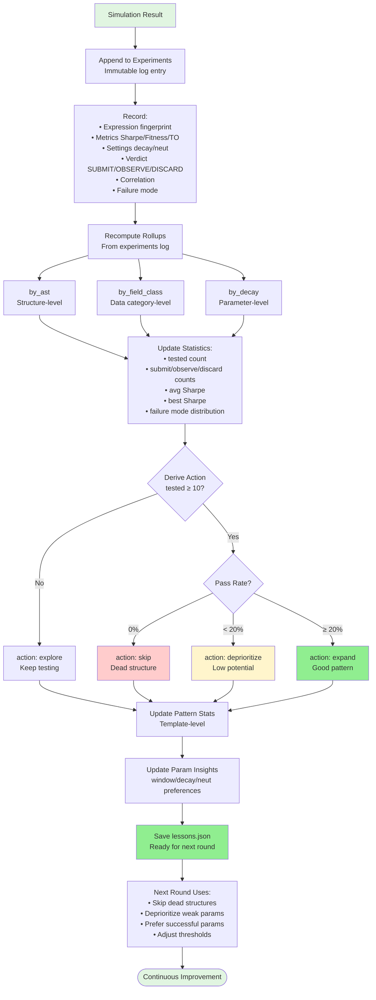

# WQ Alpha Research — Automatic Alpha Discovery System

A comprehensive system for creating and discovering WorldQuant BRAIN alpha factors through two complementary approaches: **direct template-based creation** for immediate results and **automated mining loops** for unattended research.

> **Runtime Target:** WorldQuant BRAIN · GLB TOPDIV3000 · delay=1  
> **Optimized For:** High turnover ratio test compliance  
> **Status:** ✅ Production Ready

## Table of Contents

- [System Overview](#system-overview)
- [Workflow Diagrams](#workflow-diagrams)
- [Quick Start](#quick-start)
- [Usage Modes](#usage-modes)
- [Configuration](#configuration)
- [Output Files](#output-files)
- [Documentation](#documentation)
- [System Architecture](#system-architecture)

## System Overview

### Two Complementary Modes

#### 1. Template-Based Creation (NEW ⭐)
**Direct, controlled alpha creation from curated templates**

- ✅ Immediate results (5-30 minutes)
- ✅ Manual template selection
- ✅ High turnover campaign support
- ✅ Field validation & auto-translation
- ✅ Quality gates & correlation filtering
- ✅ Perfect for focused factor development

#### 2. Automated Mining Loop
**Unattended long-running research with paper extraction**

- ✅ Breadth + depth exploration
- ✅ Paper-driven template discovery
- ✅ State persistence between runs
- ✅ Automatic template exhaustion handling
- ✅ Perfect for large-scale research campaigns

### Shared Infrastructure

Both modes share:
- **Configuration**: `config/research_target.json` (GLB/TOPDIV3000/delay=1)
- **Field Catalog**: `references/wq_glb_topdiv3000_delay1_data_fields.json` (10,000 fields)
- **Lessons Database**: `lessons.json` (accumulated experience & feedback)
- **Alpha Inventory**: `alpha_db.json` (submitted alphas & metrics)
- **API Client**: Adaptive concurrency, rate limiting, retry logic

## Workflow Diagrams

### Template-Based Creation Flow



### Mining Loop Flow



### Quality Classification Flow



### Lessons Feedback Loop



## Quick Start

### Prerequisites

```bash
pip install requests numpy
```

### 1. Configure credentials

Create [credential.txt](credential.txt) with:

```json
["username", "password"]
```

Or use environment variables:
```bash
export WQ_BRAIN_USERNAME="your_username"
export WQ_BRAIN_PASSWORD="your_password"
```

### 2. Sync fields

```bash
python3 scripts/sync_data_fields.py
```

This downloads the GLB TOPDIV3000 field catalog (10,000 fields).

### 3. Validate system

```bash
python3 scripts/test_template_system.py
```

Expected output: `✓ ALL TESTS PASSED` (5/5)

### 4. Choose your workflow

## Usage Modes

### Mode A: Template-Based Creation (⚡ Recommended for Quick Results)

Direct alpha creation from curated templates - get results in 5-30 minutes.

#### Step 1: Explore Templates

```bash
# List all available templates
python3 scripts/create_alpha_from_templates.py --list-templates

# Analyze templates with recommendations
python3 scripts/analyze_templates.py --recommendations
```

**Output:**
- 31 templates across 5 categories
- Turnover level estimates
- Field validation status
- Recommended starting commands

#### Step 2: Preview Candidates (Dry Run)

```bash
# Preview what would be created
python3 scripts/create_alpha_from_templates.py \
    --template profitability_trend \
    --max-candidates 5 \
    --dry-run
```

**Output:** Shows expressions, settings, and estimated candidate count without simulation.

#### Step 3: Create and Submit Alphas

```bash
# High win rate fundamental strategy
python3 scripts/create_alpha_from_templates.py \
    --template profitability_trend \
    --max-candidates 10

# High turnover campaign
python3 scripts/create_alpha_from_templates.py \
    --all-templates \
    --high-turnover-only \
    --max-per-template 5

# Diversified portfolio
python3 scripts/create_alpha_from_templates.py \
    --template-list profitability_trend analyst_estimate_trend sector_relative_momentum \
    --max-per-template 8
```

**Features:**
- ✅ Real-time streaming results
- ✅ Automatic quality filtering
- ✅ Correlation checking
- ✅ Auto-submission of high-quality alphas
- ✅ Progress saved after each candidate

#### Step 4: Review Results

```bash
# Summary report
cat alpha_creation_report.json

# Detailed lessons
cat lessons.json | python3 -m json.tool | less

# Alpha inventory
cat alpha_db.json | python3 -m json.tool | grep -A5 '"status": "ACTIVE"'
```

### Mode B: Automated Mining Loop (🔄 For Long-Running Research)

Unattended research with automatic breadth-depth alternation.

#### Basic Usage

```bash
# Preview without API calls
python3 scripts/mining_loop.py --dry-run --max-rounds 1

# Full run (default 50 rounds)
python3 scripts/mining_loop.py

# Custom round cap
python3 scripts/mining_loop.py --max-rounds 20

# Choose producer and depth backend
python3 scripts/mining_loop.py \
    --producer template \
    --depth-backend handoff \
    --max-rounds 30
```

#### Producers

- **`template`** (default): Expand templates from `templates/` directory
- **`llm`**: Read `llm_response.json` for LLM-generated candidates
- **`gp`**: Genetic programming - breed new structures from alpha DB

#### Depth Backends

- **`handoff`** (default): Create `depth_request.json`, wait for agent to fill `depth_response.json`
- **`claude`**: Use Claude CLI for extraction
- **`manual`**: Manual extraction fallback
- **`none`**: Disable depth phase

#### Output Files

```bash
# Final summary
cat mining_report.json

# Round-by-round state (persisted)
cat mining_state.json

# Lessons from all rounds
cat lessons.json

# Paper tracking
cat papers_registry.json
```

## Configuration

### Target Settings: `config/research_target.json`

```json
{
  "name": "glb-topdiv3000-delay1",
  "instrument_type": "EQUITY",
  "region": "GLB",
  "universe": "TOPDIV3000",
  "delay": 1,
  "neutralizations": [
    "SLOW",
    "FAST",
    "SLOW_AND_FAST",
    "SUBINDUSTRY",
    "CROWDING"
  ],
  "excluded_dataset_ids": [
    "model110"
  ],
  "fields_reference": "references/wq_glb_topdiv3000_delay1_data_fields.json"
}
```

### Quality Thresholds

| Metric | Threshold | Purpose |
|--------|-----------|---------|
| **Sharpe** | ≥ 1.5* | Risk-adjusted returns |
| **Fitness** | ≥ 1.0 | Returns / Turnover balance |
| **Turnover** | < 70% | Trading cost control |
| **Correlation** | \|corr\| < 0.7 | Portfolio diversification |
| **Robustness** | PASS | Sub-universe + concentration checks |

*Plus multiple-testing correction based on trial count

### Template Structure

Templates define factor patterns with placeholders:

```json
{
  "template_id": "profitability_trend",
  "description": "ROE/ROIC trend factors",
  "skeleton": "group_rank(ts_rank({numerator} / {denominator}, {window}), {group})",
  "field_pairs": [
    {"numerator": "operating_income", "denominator": "equity"}
  ],
  "param_ranges": {
    "window": [63, 126, 252],
    "group": ["subindustry", "industry"]
  },
  "default_settings": {
    "decay": 0,
    "neutralization": "SUBINDUSTRY"
  },
  "hypothesis": "Companies with improving profitability have higher future returns"
}
```

**Expansion:** 1 field_pair × 3 windows × 2 groups × 5 neutralizations = 30 candidates

## Output Files

### Template-Based Creation

| File | Content | Updated By |
|------|---------|------------|
| `alpha_creation_report.json` | Run summary with submitted/observed/error counts | create_alpha_from_templates.py |
| `lessons.json` | Accumulated experience & feedback | Both modes |
| `alpha_db.json` | Alpha inventory with status & metrics | Both modes |

### Mining Loop

| File | Content | Persistence |
|------|---------|-------------|
| `mining_report.json` | Campaign summary | End of run |
| `mining_state.json` | Round-by-round state | After each round |
| `papers_registry.json` | Paper consumption tracking | After depth phase |
| `depth_request.json` | Handoff request to agent | Depth phase (if handoff backend) |
| `depth_response.json` | Agent response with templates | Depth phase (if handoff backend) |

### Lessons Database Structure

```json
{
  "version": 2,
  "experiments": [
    {
      "ts": "2026-08-12T10:30:00Z",
      "alpha_id": "ABC123",
      "ast_hash": "a1b2c3...",
      "ops": ["group_rank", "ts_rank"],
      "field_classes": ["fundamental"],
      "verdict": "SUBMIT",
      "is": {"sharpe": 1.852, "fitness": 1.234, "turnover": 0.089}
    }
  ],
  "patterns": {
    "profitability_trend": {
      "tested": 30,
      "passed": 8,
      "pass_rate": 0.267,
      "avg_sharpe": 1.245,
      "action": "expand"
    }
  },
  "rollups": {
    "by_ast": { ... },
    "by_field_class": { ... },
    "by_decay": { ... }
  },
  "param_insights": {
    "window": {
      "126": {"avg_sharpe": 1.5, "verdict": "prefer"},
      "63": {"avg_sharpe": 0.9, "verdict": "deprioritize"}
    }
  }
}
```

## Documentation

### Quick References

- **[QUICK_REFERENCE.md](QUICK_REFERENCE.md)** - One-page cheat sheet with all essential commands
- **[QUICKSTART.md](QUICKSTART.md)** - Get started in 5 minutes with common workflows
- **[IMPLEMENTATION_COMPLETE.md](IMPLEMENTATION_COMPLETE.md)** - What was built and how to use it

### Complete Guides

- **[TEMPLATE_ALPHA_CREATION.md](TEMPLATE_ALPHA_CREATION.md)** - Full guide to template-based creation
  - Workflow details
  - Field translation
  - Quality gates
  - Troubleshooting
  
- **[USAGE_GUIDE.md](USAGE_GUIDE.md)** - Detailed usage patterns and best practices
  - Common use cases
  - Advanced usage
  - Monitoring & maintenance
  - Integration examples

- **[SUMMARY.md](SUMMARY.md)** - System overview and key features
  - What was modified
  - Template library
  - Performance expectations

### Domain Knowledge

- **[SKILL.md](SKILL.md)** - WorldQuant BRAIN alpha research playbook
  - Field catalog and search
  - Operator reference
  - Template library
  - IS check troubleshooting
  - API automation
  - Correlation analysis
  - Portfolio construction
  - Real-world experience (625 experiments)

### Design Documents

- **[scripts/DESIGN.md](scripts/DESIGN.md)** - System architecture and design decisions
  - Mixed architecture (script breadth + agent depth)
  - Batch fuel-mine loop pattern
  - Quality filtering strategy
  - Lessons database schema

## System Architecture

### Directory Structure

```
wq-alpha-research/
├── config/
│   └── research_target.json          # Target configuration (GLB/TOPDIV3000/delay=1)
│
├── references/
│   └── wq_glb_topdiv3000_delay1_data_fields.json  # Field catalog (10,000 fields)
│
├── templates/                         # Template library (31 templates)
│   ├── profitability_trend.json
│   ├── analyst_estimate_trend.json
│   ├── overnight_reversal.json
│   └── ... (28 more)
│
├── scripts/
│   ├── create_alpha_from_templates.py # Main: Direct template creation ⭐
│   ├── analyze_templates.py           # Template analysis & recommendations
│   ├── test_template_system.py        # System validation suite
│   │
│   ├── mining_loop.py                 # Main: Automated mining loop
│   ├── brain_api.py                   # BRAIN API client & utilities
│   ├── generate_candidates.py         # Template expansion engine
│   ├── research_target.py             # Configuration loader
│   │
│   ├── factor_gp.py                   # Genetic programming operations
│   ├── factor_gp_loop.py              # GP evolution loop
│   ├── factor_seeds.py                # Seed loading from alpha DB
│   ├── factor_ast.py                  # Abstract syntax tree for factors
│   │
│   ├── llm_producer.py                # LLM-based candidate generation
│   ├── evolve_skill.py                # Skill evolution from experience
│   ├── submit_batch.py                # Batch submission utility
│   ├── sync_data_fields.py            # Field catalog sync
│   └── DESIGN.md                      # Architecture documentation
│
├── papers/                            # Research papers (PDF)
│   ├── 1.pdf
│   └── 2.pdf
│
├── lessons.json                       # Accumulated experience database ⭐
├── alpha_db.json                      # Alpha inventory & status
├── alpha_creation_report.json         # Template creation report
├── mining_report.json                 # Mining loop summary
├── mining_state.json                  # Mining loop state (persisted)
├── papers_registry.json               # Paper consumption tracking
│
├── README.md                          # This file
├── SUMMARY.md                         # System overview
├── QUICKSTART.md                      # Quick start guide
├── QUICK_REFERENCE.md                 # One-page reference
├── TEMPLATE_ALPHA_CREATION.md         # Template creation guide
├── USAGE_GUIDE.md                     # Detailed usage guide
├── IMPLEMENTATION_COMPLETE.md         # Implementation summary
└── SKILL.md                           # WQ domain knowledge
```

### Key Components

#### 1. Template System
- **Templates** (`templates/*.json`): 31 curated factor patterns
- **Field Validator** (`generate_candidates.py`): Validates fields against GLB catalog
- **Field Translator** (`generate_candidates.py`): USA → GLB field translation (20+ mappings)
- **Template Expander** (`generate_candidates.py`): field_pairs × param_ranges expansion

#### 2. API Client
- **BrainClient** (`brain_api.py`): Session management, auth, retry logic
- **Adaptive Concurrency**: 2-8 workers based on rate limit feedback
- **Streaming Simulation**: Process results as they complete
- **Correlation Checking**: Platform authoritative + local PnL fallback

#### 3. Quality System
- **Quality Filter** (`brain_api.py`): Multi-gate filtering (Sharpe/Fitness/Turnover/Correlation)
- **Robustness Checks**: Sub-universe Sharpe, concentrated weight
- **Multiple-Testing Correction**: Automatic Sharpe adjustment
- **Lessons Integration**: Continuous improvement from past experience

#### 4. Lessons Database
- **Experiments Log**: Append-only immutable records
- **Structural Rollups**: by_ast (structure), by_field_class (data category), by_decay (parameter)
- **Pattern Statistics**: Template-level performance tracking
- **Parameter Insights**: window/decay/neutralization preferences
- **Action Derivation**: skip/deprioritize/prefer automatic decisions

#### 5. Mining Loop
- **Breadth Phase**: Template expansion → simulation → filtering
- **Depth Phase**: Paper extraction → template creation
- **State Persistence**: Resumes from last checkpoint
- **Termination Logic**: Round cap, consecutive failures, fuel exhaustion

### Technology Stack

- **Language**: Python 3.8+
- **Dependencies**: `requests`, `numpy` (minimal footprint)
- **API**: WorldQuant BRAIN REST API
- **Data**: JSON for configuration, state, and reports
- **Validation**: Field catalog with 10,000 GLB fields

### Performance Characteristics

| Metric | Template Creation | Mining Loop |
|--------|------------------|-------------|
| **Per candidate** | 30-60s (simulation) | 30-60s (simulation) |
| **Batch of 10** | 5-10 minutes | 5-10 minutes |
| **Batch of 30** | 15-30 minutes | 15-30 minutes |
| **Concurrency** | 2-8 adaptive | 2-8 adaptive |
| **Success rate** | 5-40% (category dependent) | 5-40% (category dependent) |

### Quality Metrics

| Category | Pass Rate | Avg Sharpe | Typical Turnover |
|----------|-----------|------------|------------------|
| **Fundamental** | ~40% | 1.5-2.5 | 2-8% |
| **Analyst** | ~40% | 1.5-2.3 | 9-16% |
| **Hybrid** | ~12.7% | 1.3-1.8 | 10-20% |
| **Technical** | ~5.3% | 1.2-1.5 | 15-35% |

## Key Features

### ✅ Template-Based Creation (NEW)

1. **31 Curated Templates**
   - Fundamental (4): ROE trends, quality, profitability
   - Analyst (2): Estimate trends, revision breadth
   - Technical (22): Momentum, reversal, volume patterns
   - Sentiment (1): Institutional sentiment
   - Other (2): Volatility regime, trading activity

2. **Automatic Field Translation**
   - 20+ legacy USA → GLB field mappings
   - Validates against 10,000 GLB fields
   - Suggests alternatives for unknown fields

3. **Quality Gates**
   - Sharpe ≥ 1.5 (with multiple-testing correction)
   - Fitness ≥ 1.0
   - Turnover < 70%
   - |Correlation| < 0.7
   - Robustness checks (sub-universe, concentration)

4. **Correlation Management**
   - Platform self-correlation (authoritative)
   - Local PnL correlation (fallback)
   - Pre-submission filtering
   - Portfolio diversification monitoring

5. **High Turnover Support**
   - Automatic template filtering
   - Low decay fundamental (decay=0)
   - Moderate decay analyst (decay=0-4)
   - Balance returns vs turnover

### ✅ Mining Loop Features

1. **Three Producers**
   - Template: Expand templates from directory
   - LLM: Read AI-generated candidates
   - GP: Genetic programming structure breeding

2. **Four Depth Backends**
   - Handoff: Agent file-based extraction
   - Claude: CLI-based extraction
   - Manual: Fallback extraction
   - None: Disable depth phase

3. **State Persistence**
   - Resume from last checkpoint
   - Round-by-round state tracking
   - Paper consumption tracking
   - Lessons accumulation

4. **Termination Logic**
   - Round cap (default 50)
   - Consecutive no-active threshold (3)
   - Fuel exhaustion (no papers + no candidates)

### ✅ Lessons System

1. **Append-Only Log**
   - Immutable experiment records
   - Full audit trail
   - Recomputable rollups

2. **Structural Feedback**
   - AST hash deduplication
   - Field class generalization
   - Decay parameter optimization

3. **Automatic Actions**
   - Skip: Dead structures (0% pass rate, tested ≥ 10)
   - Deprioritize: Weak patterns (<20% pass rate)
   - Prefer: Strong parameters (high avg Sharpe)

4. **Continuous Improvement**
   - Each run learns from past
   - Automatic threshold adjustment
   - Parameter preference tuning

## Monitoring & Maintenance

### Health Checks

```bash
# System validation
python3 scripts/test_template_system.py

# Template analysis
python3 scripts/analyze_templates.py

# Active alpha count
python3 -c "import json; db=json.load(open('alpha_db.json')); print(f'ACTIVE: {sum(1 for a in db[\"alphas\"].values() if a.get(\"status\")==\"ACTIVE\")}')"

# Lessons statistics
python3 -c "import json; l=json.load(open('lessons.json')); print(f'Experiments: {len(l.get(\"experiments\",[]))}')"
```

### Regular Maintenance

- **Weekly**: Sync field catalog (`python3 scripts/sync_data_fields.py`)
- **After runs**: Review lessons.json for emerging patterns
- **Before large runs**: Backup lessons.json and alpha_db.json
- **Monthly**: Review template performance, update as needed

### Troubleshooting

| Issue | Cause | Solution |
|-------|-------|----------|
| No candidates generated | Fields not available for GLB | Sync fields, check field catalog |
| All discarded | Thresholds too high | Lower `--submit-threshold` to 1.2 |
| High correlation | Too similar to existing | Check alpha_db.json, try different categories |
| API errors | Credentials/connectivity | Verify credential.txt or env vars |
| Rate limit (429) | Too many concurrent requests | System auto-adjusts, reduce WQ_MAX_CONCURRENT |

## Tips & Best Practices

### For Best Results

1. **Start Small**: Test with 1-2 templates first
2. **Use Dry Run**: Preview candidates before committing API quota
3. **Monitor Correlation**: Check after every 5-10 submissions
4. **Review Lessons**: Identify successful patterns and failing structures
5. **Diversify**: Mix fundamental, technical, and analyst factors

### For High Turnover Campaigns

1. Use `--high-turnover-only` flag
2. Focus on fundamental (decay=0) and analyst (decay=0-4)
3. Expect higher turnover but must pass <70% gate
4. Monitor fitness scores (turnover penalty)

### For Low Correlation Portfolio

1. Process templates from different categories
2. Check correlation after each submission
3. Skip templates similar to existing actives
4. Use different data sources (fundamental vs technical vs sentiment)

## Support & Resources

### Community

- **Issues**: Report bugs or request features via GitHub issues
- **Discussions**: Share experiences and ask questions
- **Contributions**: PRs welcome for template improvements

### Learning Resources

- **WorldQuant BRAIN Documentation**: [https://platform.worldquantbrain.com](https://platform.worldquantbrain.com)
- **SKILL.md**: In-repo domain knowledge from 625 experiments
- **DESIGN.md**: System architecture and design rationale

### Version History

- **v2.0** (2026-08): Template-based creation, GLB TOPDIV3000, high turnover support
- **v1.0** (2026-06): Initial mining loop implementation

## License

See LICENSE file for details.

## Acknowledgments

Built for WorldQuant BRAIN alpha research on GLB TOPDIV3000 universe with delay=1 trading.
# T-MAG
# T-MAG
